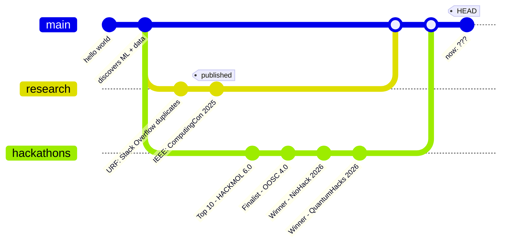
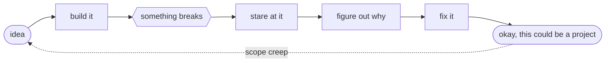
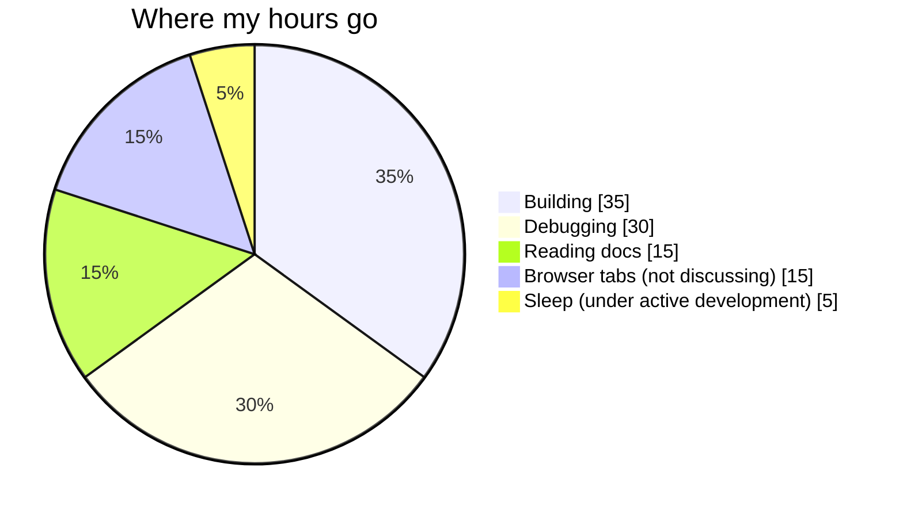

<!-- you read the source. good instinct. secret 1/3 found. -->

<div align="center">

</div>

I like the part where an idea stops being a notebook and actually has to work. ML, data and research are the main thing; side projects are everything else.

---

## $ ./choose_your_path.sh

Three doors. Click one.

<details>
<summary></summary>

<br>

```text
$ ./brief.sh --audience recruiter

focus       ML, data and research
degree      B.Tech Computer Engineering, TIET (class of 2028)
paper       IEEE ComputingCon 2025 | 94.6% accuracy, 92.9% F1
wins        NioHack 2026, QuantumHacks 2026
also        OOSC 4.0 finalist, HACKMOL 6.0 top 10
research    Undergraduate Research Fellow (NLP)
roles       Student Placement Rep (TIET), Google Gemini Student Ambassador 2026
open first  Enerlytics AI | 52,585 buildings, 4 clusters, up to $0.3M flagged
```

Reach me: [its.lavdeep.singh@gmail.com](mailto:its.lavdeep.singh@gmail.com)

</details>

<details>
<summary></summary>

<br>

```text
$ ./brief.sh --audience researcher

urf         unsupervised duplicate-question detection (Stack Overflow)
pipeline    TF-IDF -> Sentence-BERT -> K-Means, DBSCAN
evaluation  cluster purity, recall
paper       Sparse PCA + ensembles (RF, XGBoost, CatBoost, Optuna)
result      94.6% accuracy, 92.9% F1 (IEEE ComputingCon 2025)
interests   NLP, semantic representations, clustering
```

Always up for a research conversation. Email is at the bottom.

</details>

<details>
<summary></summary>

<br>

```text
$ ./brief.sh --audience developer

start with  AcadHub: the schema (12 entities, triggers, views, procedures)
then        Enerlytics AI: PCA + K-Means pipeline, Streamlit dashboard
working on  writing code I can explain line by line
welcome     honest code review
```

[AcadHub](https://github.com/LavdeepSingh23/AcadHub) . [Enerlytics AI](https://github.com/LavdeepSingh23/Unsupervised-Energy-Optimization-Analytics)

</details>

---

## $ cat achievements.log

<div align="center">

</div>

---

## $ ./stats

<div align="center">

</div>

```text
research    NLP . semantic representations . clustering
building    ML systems, data apps, side projects with questionable scope
learning    DSA . C++ . software engineering
```

---

## $ ls ./projects

<details>
<summary><b>Enerlytics AI</b> &nbsp;|&nbsp; 52,585 buildings -> 4 clusters -> up to $0.3M flagged</summary>

<br>

**Problem:** smart buildings burn energy in patterns nobody has labelled.<br>
**Approach:** PCA + K-Means behavioural segmentation, anomaly detection, a Streamlit analytics dashboard.<br>
**Result:** 4 behavioural clusters and optimization insights worth up to $0.3M in potential savings.<br>
**Source:** [Unsupervised-Energy-Optimization-Analytics](https://github.com/LavdeepSingh23/Unsupervised-Energy-Optimization-Analytics)

</details>

<details>
<summary><b>AcadHub</b> &nbsp;|&nbsp; 12 entities . role-based access . 10+ analytics reports</summary>

<br>

**Problem:** LMS, WebKiosk and previous-year papers live in three different places.<br>
**Approach:** MySQL and PL/SQL, with procedures, triggers, views and transactions.<br>
**Result:** one platform, 12 interconnected entities, role-based access control and 10+ academic analytics reports.<br>
**Source:** [AcadHub](https://github.com/LavdeepSingh23/AcadHub)

</details>

<details>
<summary><b>Stack Overflow Duplicate Detection</b> &nbsp;|&nbsp; TF-IDF -> Sentence-BERT -> K-Means / DBSCAN</summary>

<br>

**Problem:** which programming questions are secretly the same question?<br>
**Approach:** TF-IDF as the baseline, Sentence-BERT embeddings, K-Means and DBSCAN clustering.<br>
**Result:** an unsupervised pipeline evaluated on cluster purity and recall. This is my Undergraduate Research Fellowship project.

</details>

<details>
<summary><b>Enhanced Diabetes Prediction</b> &nbsp;|&nbsp; 94.6% accuracy . 92.9% F1 . IEEE</summary>

<br>

**Problem:** better prediction with fewer features.<br>
**Approach:** Sparse PCA, Random Forest, XGBoost, CatBoost, Optuna.<br>
**Result:** 94.6% accuracy, 92.9% F1, and an IEEE conference publication (ComputingCon 2025).<br>
**Source:** [Enhanced-Diabetes-Prediction](https://github.com/idklol22/Enhanced-Diabetes-Prediction-using-Ensemble-Learning-and-SparsePCA-based-Feature-Reduction-)

</details>

---

## $ python kmeans_me.py

```text
cluster 0 | research      | NLP, semantic representations, clustering
cluster 1 | build         | ML systems, data projects, dashboards
cluster 2 | compete       | hackathons, finals, "one more feature" at 3am
cluster 3 | fundamentals  | DSA, C++, software engineering

inertia          : high
silhouette score : still tuning
optimal k        : ask me again next semester
```

---

## $ git log --graph



---

## $ cat workflow.md



---

## $ pip list

<div align="center">

</div>

---

## $ cat todo.md

- [x] ship a research paper (IEEE)
- [x] win a hackathon (twice)
- [ ] write code I can explain line by line
- [ ] solve the problem *before* opening the search bar
- [ ] need less help the next time I build something

---

## $ ls -a ./hidden

Two of the three secrets are in here. The third is somewhere you've already looked.

<details>
<summary><code>time_audit.png</code> (self-reported, completely unaudited)</summary>



</details>

<details>
<summary><code>git blame me</code> (stats, if you're into that)</summary>

<p align="center">
  
  
</p>

<p align="center">
  
</p>

</details>

<details>
<summary><code>sudo rm -rf /sleep_schedule</code> (do not open)</summary>

<br>

told you. secret 2/3.

```text
repositories       more than I planned
unfinished ideas   definitely more than I planned
browser tabs       not discussing this
sleep schedule     under active development
```

Found all 3? Mail me with the subject `found them` and the locked tile above gets a story.

</details>

---

## $ ping lavdeep

<p align="center">
  <a href="https://github.com/LavdeepSingh23">github</a> &nbsp;.&nbsp;
  <a href="https://www.linkedin.com/in/YOUR-HANDLE">linkedin</a> &nbsp;.&nbsp;
  <a href="mailto:its.lavdeep.singh@gmail.com">its.lavdeep.singh@gmail.com</a>
</p>

<div align="center">

```text
building -> breaking -> fixing -> learning -> repeat
```

</div>
