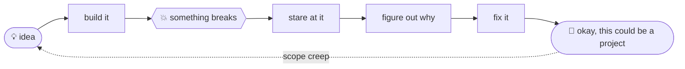
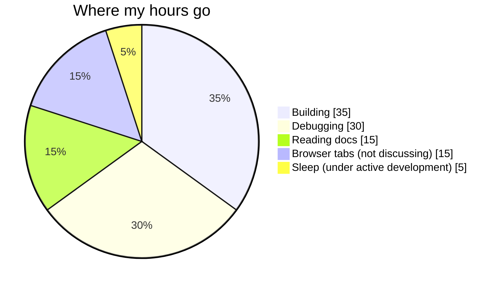

<!-- 👀 you read the source. good instinct. secret 1/3 found. -->

<div align="center">


# Lavdeep Singh

<a href="https://github.com/LavdeepSingh23">
  
</a>


</div>

---

```text
lavdeep@thapar:~$ whoami
lavdeep_singh — Computer Engineering, pre-final year @ TIET

lavdeep@thapar:~$ cat now.txt
research       NLP · semantic representations · clustering
building       ML systems, data apps, side projects with questionable scope
learning       DSA · C++ · software engineering

lavdeep@thapar:~$ ls -a ./secrets
.   ..   [3 hidden things live in this README. good luck.]
```

---

## 🧬 commit history (the short version)


**Roles:** Student Placement Representative @ TIET · Google Gemini Student Ambassador 2026 · ACM Student Chapter

---

## 🧪 model zoo

| Project | The problem | Under the hood | The result |
|---|---|---|---|
| [**Enerlytics AI**](https://github.com/LavdeepSingh23/Unsupervised-Energy-Optimization-Analytics) | How do buildings actually behave with energy? | PCA + K-Means, anomaly detection, Streamlit | 52,585 buildings → 4 behavioural clusters → up to **$0.3M** in savings flagged |
| [**AcadHub**](https://github.com/LavdeepSingh23/AcadHub) | LMS, WebKiosk and PYQs live in 3 different places | MySQL, PL/SQL, triggers, views, role-based access | 12 interconnected entities, 10+ analytics reports |
| **SO Duplicate Detection** | Which programming questions are secretly the same? | TF-IDF, Sentence-BERT, K-Means, DBSCAN | Evaluated on cluster purity and recall |
| [**Enhanced Diabetes Prediction**](https://github.com/idklol22/Enhanced-Diabetes-Prediction-using-Ensemble-Learning-and-SparsePCA-based-Feature-Reduction-) | Better prediction with fewer features | Sparse PCA, RF, XGBoost, CatBoost, Optuna | **94.6%** accuracy · **92.9%** F1 → IEEE paper |

---

## 🎯 k-means, but on me

```text
cluster 0 │ research      │ NLP, semantic representations, clustering
cluster 1 │ build         │ ML systems, data projects, dashboards
cluster 2 │ compete       │ hackathons, finals, "one more feature" at 3am
cluster 3 │ fundamentals  │ DSA, C++, software engineering

inertia          : high
silhouette score : still tuning
optimal k        : ask me again next semester
```

---

## 🔁 how I build things



---

## 🛠️ stack


---

## 📋 TODO.md

- [x] ship a research paper (IEEE)
- [x] win a hackathon (twice)
- [ ] write code I can explain line by line
- [ ] solve the problem *before* opening the search bar
- [ ] need less help the next time I build something

---

## 🕳️ things you can open

<details>
<summary>📊 <code>time_audit.png</code> (self-reported, completely unaudited)</summary>



</details>

<details>
<summary>📈 <code>git blame me</code></summary>

<p align="center">
  
  
</p>

<p align="center">
  
</p>

<p align="center">
  
</p>

</details>

<details>
<summary>⚠️ <code>sudo rm -rf /sleep_schedule</code> (do not open)</summary>

<br>

told you. secret 2/3.

```text
repositories       more than I planned
unfinished ideas   definitely more than I planned
browser tabs       not discussing this
sleep schedule     under active development
```

Found all 3? Mail me with the subject `found them`.

</details>

---

## 📡 connect

[](https://github.com/LavdeepSingh23)
[](https://www.linkedin.com/in/YOUR-HANDLE)
[](mailto:its.lavdeep.singh@gmail.com)

<div align="center">

```text
building → breaking → fixing → learning → repeat
process exited with code 0
```


</div>
