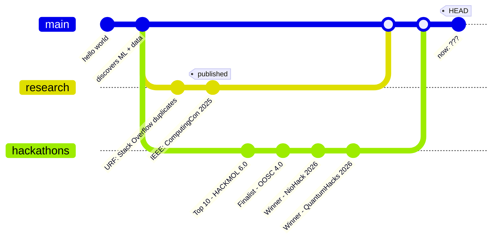
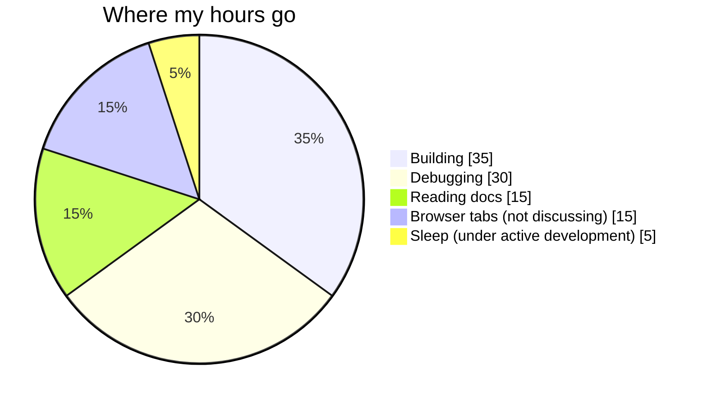

<!-- you read the source. good instinct. secret 1/3 found. -->
 
<div align="center">


 
</div>
I like the part where an idea stops being a notebook and actually has to work. ML, data and research are the main quest; side projects are the side quests.
 
---
 
## $ ./choose_your_path.sh
 
Pick who you are. Each one opens a different cheat sheet.
 
<details>
<summary><b>[1] I'm a recruiter. Give me 30 seconds.</b></summary>
<br>
- Computer Engineering student at TIET, pre-final year, working across ML, data and research
- IEEE conference paper (ComputingCon 2025): **94.6%** accuracy and **92.9%** F1 on diabetes prediction
- 2x hackathon winner (NioHack 2026, QuantumHacks 2026), OOSC 4.0 finalist, HACKMOL 6.0 top 10
- Undergraduate Research Fellow, working on NLP for duplicate question detection
- Student Placement Representative at TIET, Google Gemini Student Ambassador 2026
- Open this first: **Enerlytics AI**. 52,585 buildings, 4 behavioural clusters, up to $0.3M in savings flagged
- Reach me: [its.lavdeep.singh@gmail.com](mailto:its.lavdeep.singh@gmail.com)
</details>
<details>
<summary><b>[2] I'm a researcher. Show me the science.</b></summary>
<br>
- **Stack Overflow duplicate detection (URF):** unsupervised detection of semantically similar programming questions. TF-IDF baseline, then Sentence-BERT embeddings, clustered with K-Means and DBSCAN, evaluated on cluster purity and recall.
- **IEEE paper:** Sparse PCA feature reduction plus ensemble learning (Random Forest, XGBoost, CatBoost, tuned with Optuna) for diabetes prediction.
- **Interests:** NLP, semantic representations, clustering.
- Always up for a research conversation. Email is at the bottom.
</details>
<details>
<summary><b>[3] I'm a fellow dev. What's worth reading?</b></summary>
<br>
- [**AcadHub**](https://github.com/LavdeepSingh23/AcadHub): start with the schema. 12 entities, triggers, views, procedures and role-based access, all in MySQL and PL/SQL.
- [**Enerlytics AI**](https://github.com/LavdeepSingh23/Unsupervised-Energy-Optimization-Analytics): PCA + K-Means pipeline with a Streamlit dashboard on top.
- I'm actively trying to write code I can explain line by line, so honest code review is welcome.
</details>
---
 
## $ cat achievements.log
 
<div align="center">

</div>
---
 
## $ ./character_sheet
 
<div align="center">

</div>
```text
ACTIVE QUESTS
research    NLP . semantic representations . clustering
building    ML systems, data apps, side projects with questionable scope
learning    DSA . C++ . software engineering
```
 
---
 
## $ ls ./boss_fights
 
Click a boss to see how it went down.
 
<details>
<summary><b>Enerlytics AI</b> &nbsp;|&nbsp; 52,585 buildings -> 4 clusters -> up to $0.3M flagged</summary>
<br>
**The fight:** smart buildings burn energy in patterns nobody has labelled.<br>
**The weapons:** PCA + K-Means behavioural segmentation, anomaly detection, a Streamlit analytics dashboard.<br>
**The loot:** 4 behavioural clusters and optimization insights worth up to $0.3M in potential savings.<br>
**Source:** [Unsupervised-Energy-Optimization-Analytics](https://github.com/LavdeepSingh23/Unsupervised-Energy-Optimization-Analytics)
 
</details>
<details>
<summary><b>AcadHub</b> &nbsp;|&nbsp; 12 entities . role-based access . 10+ analytics reports</summary>
<br>
**The fight:** LMS, WebKiosk and previous-year papers live in three different places.<br>
**The weapons:** MySQL and PL/SQL, with procedures, triggers, views and transactions.<br>
**The loot:** one platform, 12 interconnected entities, role-based access control and 10+ academic analytics reports.<br>
**Source:** [AcadHub](https://github.com/LavdeepSingh23/AcadHub)
 
</details>
<details>
<summary><b>Stack Overflow Duplicate Detection</b> &nbsp;|&nbsp; TF-IDF -> Sentence-BERT -> K-Means / DBSCAN</summary>
<br>
**The fight:** which programming questions are secretly the same question?<br>
**The weapons:** TF-IDF as the baseline, Sentence-BERT embeddings, K-Means and DBSCAN clustering.<br>
**The loot:** an unsupervised pipeline evaluated on cluster purity and recall. This one is my Undergraduate Research Fellowship project.
 
</details>
<details>
<summary><b>Enhanced Diabetes Prediction</b> &nbsp;|&nbsp; 94.6% accuracy . 92.9% F1 . IEEE</summary>
<br>
**The fight:** better prediction with fewer features.<br>
**The weapons:** Sparse PCA, Random Forest, XGBoost, CatBoost, Optuna.<br>
**The loot:** 94.6% accuracy, 92.9% F1, and an IEEE conference publication (ComputingCon 2025).<br>
**Source:** [Enhanced-Diabetes-Prediction](https://github.com/idklol22/Enhanced-Diabetes-Prediction-using-Ensemble-Learning-and-SparsePCA-based-Feature-Reduction-)
 
</details>
---
 
## $ python kmeans_me.py
 
```text
cluster 0 | research      | NLP, semantic representations, clustering
cluster 1 | build         | ML systems, data projects, dashboards
cluster 2 | compete       | hackathons, finals, "one more feature" at 3am
cluster 3 | fundamentals  | DSA, C++, software engineering
 
inertia          : high
silhouette score : still tuning
optimal k        : ask me again next semester
```
 
---
 
## $ git log --graph
 

 
---
 
## $ cat workflow.md
 

 
---
 
## $ pip list
 


 
---
 
## $ cat quest_log.md
 
- [x] ship a research paper (IEEE)
- [x] win a hackathon (twice)
- [ ] write code I can explain line by line
- [ ] solve the problem *before* opening the search bar
- [ ] need less help the next time I build something
---
 
## $ ls -a ./hidden
 
Two of the three secrets are in here. The third is somewhere you've already looked.
 
<details>
<summary><code>time_audit.png</code> (self-reported, completely unaudited)</summary>

 
</details>
<details>
<summary><code>git blame me</code> (stats, if you're into that)</summary>
<p align="center">
  
  
</p>
<p align="center">
  
</p>
</details>
<details>
<summary><code>sudo rm -rf /sleep_schedule</code> (do not open)</summary>
<br>
told you. secret 2/3.
 
```text
repositories       more than I planned
unfinished ideas   definitely more than I planned
browser tabs       not discussing this
sleep schedule     under active development
```
 
Found all 3? Mail me with the subject `found them` and the locked tile above gets a story.
 
</details>
---
 
## $ ping lavdeep
 
[](https://github.com/LavdeepSingh23)
[](https://www.linkedin.com/in/YOUR-HANDLE)
[](mailto:its.lavdeep.singh@gmail.com)
 
<div align="center">
```text
building -> breaking -> fixing -> learning -> repeat
press START to continue
```
 
</div>
 